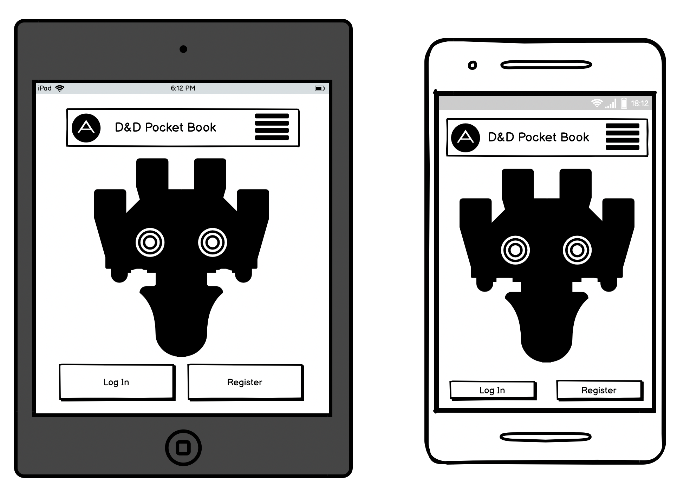
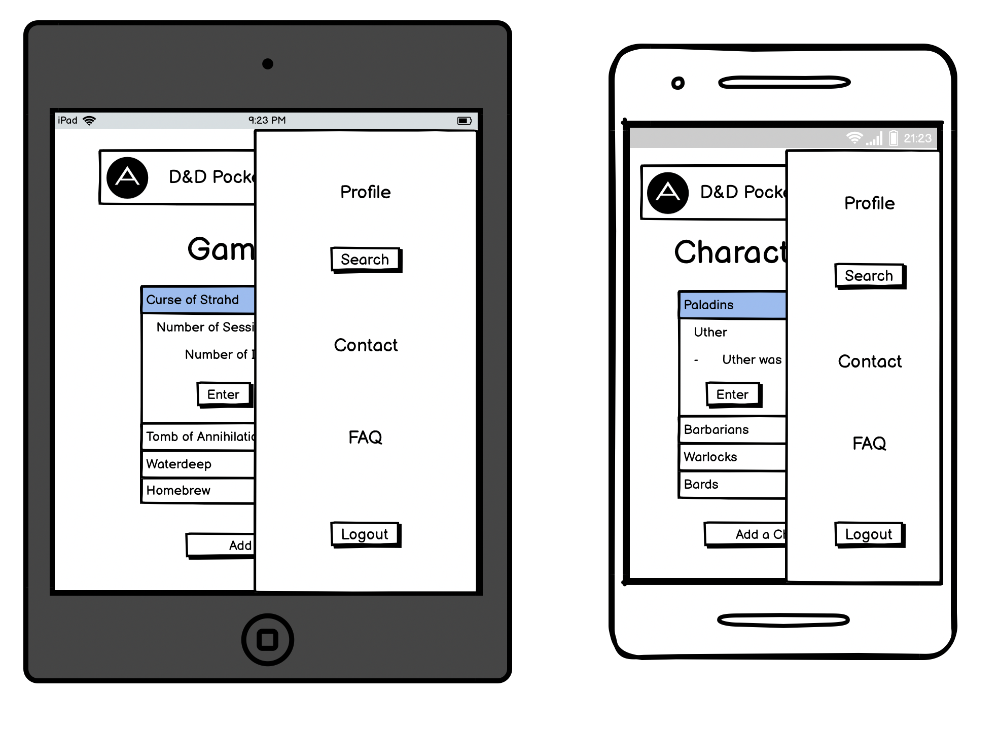
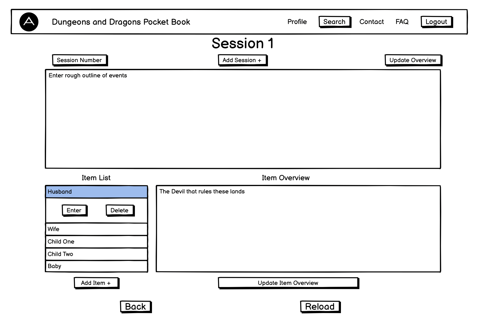
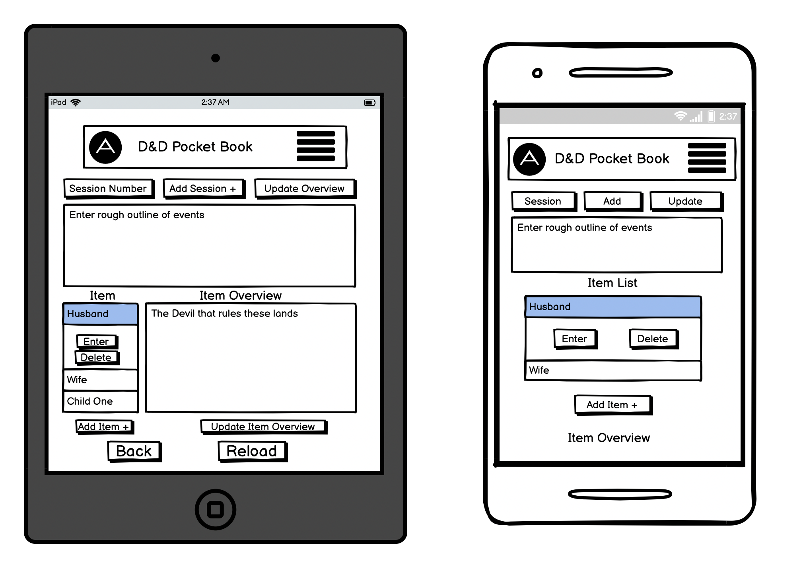
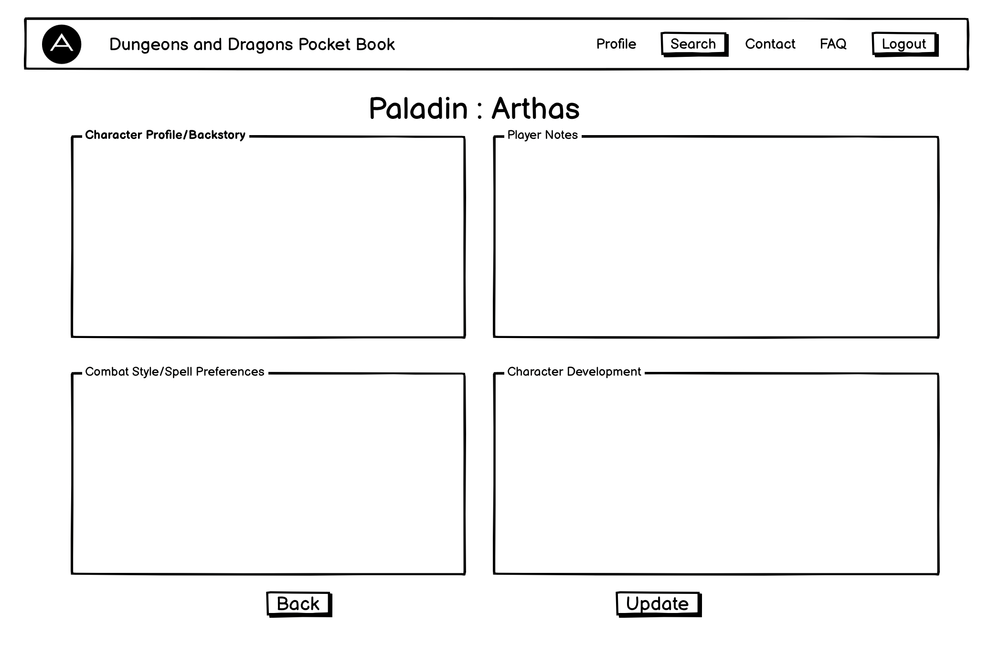

# **Dunegeons and Dragons Pocket Book**

Live Link - [https://d-and-d-pocket-book.herokuapp.com/](https://d-and-d-pocket-book.herokuapp.com/)

---

## **Table of Contents**

---

- [Overview](#overview)
- [UX](#ux)
  - [Stories](#stories)
  - [Strategy](#strategy)
  - [Scope](#scope)
  - [Structure](#structure)
  - [Skeleton](#skeleton)
  - [Surface](#surface)
- [Wireframes](#wireframes)
- [Features](#features)
- [Testing](#testing)
  - [Bugs](#bugs)
- [Technologies Used](#technologies-used)
- [Resources](#resources)
- [Project barriers and the solutions](#project-barriers-and-the-solutions)
- [Deployment](#deployment)
- [Credits](#credits)
- [Acknowledgements](#acknowledgements)
- [Support](#support)

---

## **Overview**

---

The Dungeons and Dragons Pocket book is an application designed for note taking in a more streamlined, structured and user friendly way.

The UX is focused on being able to create and edit a list of characters and games while storing detailed notations on each.

---

## **UX**

---

### **Stories**

#### **User Stories**

As a user I would like to...

- Be able to register/login and manage the content in my own account
- Have a space to input and store text in an organised and user friendly way
- Create a list of games and characters that are easily accessible on all devices
- Be able to create sessions and detailed notations about what transpired during them
- A seperate list and notations sections for items such as people or places encounteredduring the game
- Have sections for character notes with specifc faccets of everything I need to know/remember about my character

#### **Developer Stories**

"I learned to play D&D recently so learning coding at the same time has intwined them both in my current learning. 
I felt it appropriate to combine these two passions into one project"

"D&D is very complex, as is coding. This being my first project working with databases, I felt that using the game 
as a basis for building my project would be both challenging and engaging."

"Whilst playing the game I often hear my fellow players struggling to remember things and also sifting through
through their notes looking for something specific. I feel this app fill a real need for D&D enthusiasts"

### **Strategy**

#### **Project Goals:**

I believe this project fits a real need in the tabletop community and has potential to expand its functionality and scope.
My main focus of this project is to achieve proof of concept and see how the project performs among my peers.

- Create a database that will allow unique users to control and manipulate as they see fit.
- Ther user to be able to create a list of all their games and characters, and input data to be easily recalled when needed.
- To optimize the UX so that during a game the user would have as much CRUD functionality as possible on a single page.
- The application to be responsive on all devices to wether the user is playing in person or online they will have easy access.

#### **User Goals:**

- To eliminate the need for handwritten notes and speed up the recall of events.
- 
- 
- 

---

[Return to Table of Contents](#table-of-contents)

---

### **Scope**

#### **Planned Functionality:**

Navbar:

- 
- 
- 
- 

Login-Register Page:

- 
- 
- 
-  

Profile Page:

- 
- 
- 
- 

Game Page:

- 
- 
- 
- 

Character Page:

- 
- 
- 
- 

---

[Return to Table of Contents](#table-of-contents)

---

### **Structure**

#### **Interaction Design:**

Navbar:

- 
- 
- 
- 

Login-Register Page:

- 
- 
- 
-  

Profile Page:

- 
- 
- 
- 

Game Page:

- 
- 
- 
- 

Character Page:

- 
- 
- 
- 

Galaxy Page:

- When the user presses the "Good Luck!" button, the header and footer return off the screen and as we see the introduction panel return into the galaxy, the background image increases in size creating the illusion that the user is also entering the centre of the galaxy. After the animation finishes the user is forwarded to the riddle page.
- The email address in an anchor with mailto tags for users default mail application to create a blank email directly
- The social link icons are anchors to my personal profiles page on the respective outlets

Riddle Page:

- The explanation panel has two buttons. Start - Back
  - Start - Removes the box and the user may begin the riddle
  - Back - Returns the user to the galaxy page
- There are twenty-five input elements for answering the riddle, all of which cause the page to respond depending on the input.
- There are three buttons in the controls section. Hint - Clues - Notepad
- Hint - the hint checker box obscures the hint and double checks the user does indeed need a hint.
  - Yes, I am hopelessly lost - reveals the hint based on the user's current answers
  - No, I will try harder - changes the panel to no-hint which displays "Excellent choice, I am so proud."
- Clues - Shows a list of the 15 clues and the question of the riddle "Who owns the fish?"
- Notepad - A textarea box appears that the user can type notes into if needed
- If the user enters the same answer 3 times a reset button appears where the clues-controls div is located, where that the user can press to reload the page
- When the user completes the riddle the clues-control div is replaced by the congratulations panel which has three buttons. Reset - Back to Galaxy - Feed the Cat
  - Reset - reloads the page
  - Back to Galaxy - returns the user to the galaxy page
  - Feed the Cat - Removes the fish gif and plays the cat audio, purely for satire purposes

#### **Information Design:**

Navbar:

- 
- 
- 
- 

Login-Register Page:

- 
- 
- 
-  

Profile Page:

- 
- 
- 
- 

Game Page:

- 
- 
- 
- 

Character Page:

- 
- 
- 
- 

Galaxy Page:

- The header states the title of the web application - The Einstein Riddle
- The introduction paragraph states the purpose of and the theorized success rate of the riddle.
- The footer contains the creator's contact information and anchors to their corresponding profiles to the relevant icon

Riddle Page:

- Explanation panel emerges from the centre of the screen to explain the riddle and give some friendly advice to the user
- The Einstien pictures serve as a prompt to the user depending on what actions they take
  - Wink - the user has entered a correct answer
  - Angry face - the user has entered an incorrect answer
  - Einstein clapping gif - the user has completed the riddle
  - Cheat pic - A demonised version of the caricature when the user attempts to break the ha,e
- Clues panel bullet points the 15 clues and highlights the riddles question.
- Hints checker offers the user to either confirm they want a clue or opt-out
  - Yes, I am hopelessly lost - reveals the hint based on the user's current answers
  - No, I will try harder - changes the hint text to " Excellent choice, I am so proud."
- Hint panel shows the user a clue that is relevant depending on the current level of progression

---

[Return to Table of Contents](#table-of-contents)

---

### **Skeleton**

- [Wireframes](#wireframes)
- Persistant navbar on all pages that allows for navigation of the app and logging out
- Login-Register page that has 2 buttons to switch between the login or register panels
- Profile page shows the user logged in and the list of games and characters they have created, along with buttons to create new ones
- Game page with 2 sections, sessions and items. Text areas for user input and buttons to create instances and update the content assocatied with them.
- Character page with 4 text boxes and 2 buttons.

[Return to Table of Contents](#table-of-contents)

---

### **Surface**

#### **Images**

Base Background: Is the constant background on all pages and is basis for the overall color scheme of the site.

Error GIF: A gif to simulate an encounter in Dungeons & Dragons. The gif moves around the page and depending on its position on the page will block users from pressing the back button.

#### **Colours**

I used the background image as a basline for the color scheme of the overall site.

[Coolers](https://coolors.co/) was then used to choose colors to compliment the baseline

#### **Typography**

- "Titillium" font (san serif as backup)

---

[Return to Table of Contents](#table-of-contents)

---

## **Wireframes**

---
Hompage

Homepage with login panel

Homepage on medium/small devices

Homepage on medium/small devices with login panel

Profile page

Profile page on medium/small devices

Game page

Game page on medium/small devices

Character page

Character page on medium/small devices


---

[Return to Table of Contents](#table-of-contents)

---

## **Features**

---

### **Existing Features**

- Designed with HTML5, CSS3, JavaScript and Python.
- 7 separate HTML pages.
- Navbar with logo/title, anchors, logout button and sidenav with anchors.
- Collapsible headers/bodies on games, classes, characters and items.
- Dropdown triggers/content to allow the users to switch between sessions.
- Selector for picking the relevant class on character creation.
- Modal pop up when adding a new session to a user created game.

### **Features Left to Implement when skills develop**

- Sharing games,characters,sessions and items between different users.
- Opportunity for users to upload chatacter art to their profiles.
- A Board/Chatroom space for users to discuss games and possibly network to create new games/groups. 
- A password reset option for users

---

[Return to Table of Contents](#table-of-contents)

---

## **Testing**

---

### **Screen Testing**

Checked compatibility in Safari, Chrome, Firefox

#### Google Chrome Developer Tools - Device frames tests

- Moto G4
- Galaxy S5
- Pixel 2
- Pixel 2 XL
- iPhone 5/SE
- iPhone 6/7/8
- iPhone 6/7/8 Plus
- iPhone X
- iPad
- iPad Pro
- Surface Duo
- Galaxy Fold

#### [Media Genisis Responsiveness Checker](https://responsivedesignchecker.com/)

#### Desktop Screen Sizes

- 24" - 1920x1200
- 23" - 1920x1080
- 22" - 1680x1050
- 20" - 1600x900

#### Notebook Sizes

- 15" - 1366x768
- 13" - 1024x800
- 10" - 1024x600

#### Tablet Screen Sizes

- iPad Mini - 768x1024
- iPad Retina - 768x1024
- iPad Pro - 1366x1024
- Kindle Fire - 768x1024
- Kindle Fire HD - 768x1024
- Asus Eee - 768x1024
- Nexus 7 - 600x960
- Nexus 9 - 1024x768
- Galaxy Tab 10 - 800x1280

#### Tablet Screen Sizes

- Apple iPhone 3/4/4s - 320x480
- Apple iPhone 5/5s - 320x586
- Apple iPhone 6/6s/7 - 375x667
- Apple iPhone 6 Plus/7 Plus - 414x736
- Samsung Galaxy S5/S6/S7 - 360x640
- Sony Xperia Z2/Z3 - 360x640
- Google Pixel - 411x731
- Nexus 4 - 384x640
- Nexus 5 - 411x731
- Nexus 6 - 411x731

I have tested the website on various physical devices (iPad, iPad Air, Macbook Pro)

### **Validator**

- HTML - [W3C](https://validator.w3.org/) - Markup Validation

- CSS - [W3C](https://jigsaw.w3.org/css-validator/) - Jigsaw CSS Validation

- JavaScript - [JSHINT](https://jshint.com/) - JavaScript code warning & error check

- Python - [Pyton Tester](https://extendsclass.com/python-tester.html) Python code syntax checker

### **Defensive Design**

- If a user attempts to enter the same answer in multiple boxes, the entire riddle will be disabled and an onscreen message with a giant reset button will show on the screen.
- Ensuring all target="\_blank" links are accompanied by rel="noreferrer".
- Designing the site to be comfortably navigated without having to use the back button in the browser interface.

---
### Manual Testing 
---

#### **Navbar**

- "Good Luck!" button initiates the animation and correctly opens up riddle.html after the designated time delay has passed.
- All social links open a new tab to my profile on the designated media site

#### **Login-Register**

- "Good Luck!" button initiates the animation and correctly opens up riddle.html after the designated time delay has passed.
- All social links open a new tab to my profile on the designated media site

#### **Profile**

- "Good Luck!" button initiates the animation and correctly opens up riddle.html after the designated time delay has passed.
- All social links open a new tab to my profile on the designated media site

#### **Game**

- "Good Luck!" button initiates the animation and correctly opens up riddle.html after the designated time delay has passed.
- All social links open a new tab to my profile on the designated media site

#### **Character**

- "Good Luck!" button initiates the animation and correctly opens up riddle.html after the designated time delay has passed.
- All social links open a new tab to my profile on the designated media site

---

### **Bugs**

---

#### **Found**

1. Timer buttons would stop working if the play button was pressed twice
2. The audio files would not play, and console test eg(console.log(cats.duration)) were returning NaN
3. The hint checker "No, I will try harder" changes the text of the hint to "Excellent choice, I am so proud" but doesn't if the user does decide to opt for the hint later it does switch back to the original hint.
4. window.location objects work within GitPod but when pushed to GitHub the live site threw back a 404 error
5. When being viewed on an iPad, the url and tab bar were preventing the user from being able to access the bottom input elements without the keyboard being on the screen.

#### **Resolution**

1. This was caused as the code snippet created a new instance every time the play button was pressed, so 2 or more presses on the play button caused the pause and reset button to affect the subsequent instances rather than the first
2. It just turned out the file path was incorrect, the code was correct otherwise
3. Created another div ("no-hint") that displays instead of the hint div
4. Swapping the objects for document.location.href and location.reload() resolved the issue
5. I commented out the overflow:hidden in both css files to allow the user to scroll if needed.

#### **Unresolved**

- The site is not as responsive as I would like, medium-size device screens in portrait are not ideal, but due to time constraints and my skill limitations, I was unable to make it fully responsive.
- While testing the device on my iPad, I realised my css was being overwritten. When input was disabled due to a correct answer, the element appearing to be slightly transparent. Due to time constraints, I could not resolve this issue.

[Return to Table of Contents](#table-of-contents)

---

## **Technologies Used**

---

### **1. Languages**

- [HTML5](https://en.wikipedia.org/wiki/HTML5)
- [CSS3](https://en.wikipedia.org/wiki/Cascading_Style_Sheets)
- [JavaScript](https://en.wikipedia.org/wiki/JavaScript)
- [Python](https://en.wikipedia.org/wiki/Python_(programming_language))

### **2. Integrations**

- [Materialize](https://materializecss.com/) by linking via [Materialize CDN](https://materializecss.com/getting-started.html) to HTML Doc
- [jQuery](https://jquery.com) by linking via jQueryCDN to HTML Doc.
- [FontAwesome](https://fontawesome.com/) Icons for links in Footer.
- [Google Fonts](https://fonts.google.com/) - Overall Typography import.
- [Flask](https://flask.palletsprojects.com/en/1.1.x/) Micro web framework written in Python
- [MongoDB](https://www.mongodb.com/) NoSQL database program, using JSON-like documents


### **3. Workspace, version control and Repository storage**

- [GitPod](https://github.com/mkuti/corklagos-venture/blob/master/gitpod.io) - Main workspace IDE(Integrated Development Environment)
- [Git](https://git-scm.com/) - Distributed Version Control tool to store versions of files and track changes.
- [GitHub](https://github.com/) - A cloud-based hosting service to manage my **Git** repositories.
- [Heroku](https://heroku.com) - Container-based cloud platform for deployment and running of apps

---

[Return to Table of Contents](#table-of-contents)

---

## **Resources**

---

- [Code Institute Course Content](https://courses.codeinstitute.net/)
- Code Institute **SLACK Community**
- [Coolers](https://coolors.co/) - Color picker
- [Stack Overflow](https://stackoverflow.com/) - General resource.
- [Youtube](https://www.youtube.com/) - General resource.
- [CSS-Tricks](https://css-tricks.com/) - General resource.
- [W3.CSS](https://www.w3schools.com/w3css/4/w3.css) - General resource.
- [Balsamiq](https://balsamiq.com/wireframes/) - Wire-framing design tool.
- Unicorn Revealer - Chrome Extension
- ColorZilla - Chrome Extension

---

[Return to Table of Contents](#table-of-contents)

---

## **Project barriers**

---

- 
- 
- 
- 
- 

---

[Return to Table of Contents](#table-of-contents)

---

## **Deployment**

---

GitPod was used to write all code in this repository and pushed via Git to GitHub.

### Local Installation

#### 1. Cloning the project

- The code can be run locally through clone or download from the repository on [GitHub](https://github.com/Aramantos/MS3-D-and-D-Pocket-Book).
- You can do this by opening the repository, clicking on the Code' button and selecting either 'clone or download'.

    
- The Clone option provides a URL, which you can use on your CLI with `git clone <paste url>`.
- The Download ZIP option provides a link to download a ZIP file which can be unzipped on your local machine. The files can then be uploaded to your IDE.

#### 2. Create Environmental Variables

- Create an env.py file, in this file enter the Environmental Variables (**replace values with your own**) as follows:

```python
        import os

        os.environ.setdefault("IP", "IP_ADDRESS")
        os.environ.setdefault("PORT", "PORT")
        os.environ.setdefault("SECRET_KEY", "SECRET_KEY")
        os.environ.setdefault("MONGO_URI", "MONGO_URI")
        os.environ.setdefault("MONGO_DBNAME", "MONGO_DBNAME")
```

#### 3. Create a .gitignore file

- Create a file called **.gitignore** in the root directory and ensure it contains the following git exclusions:

```text
        core.Microsoft*
        core.mongo*
        core.python*
        env.py
        __pycache__/
        *.py[cod]
        node_modules/
```

#### 4. Install project dependencies

- Install project requirements by typing `pip install -r requirements.txt`

#### 5. Create a database on MongoDB

Register for a free account with [MongoDB](https://account.mongodb.com/account/register)

- Create a new Project and call it 'DandD-PocketBook'
- Creater a Cluster, choose the free tier option and select your region, the name I choose was 'PocketBook'
- Create a new database and call it 'd-and-d-pocket-book'
- Create five Collections named 'characters', games', 'items', 'sessions' and 'users' an enter key/values as follows:  

- **characters** collection

```json
            _id: <ObjectId>
            character_name: "<string>"
            class: "<string>"
            profile_backstory: "<string>"
            player_notes: "<string>"
            combat_spells: "<string>"
            character_development: "<string>"
            created_by: "<string>"
```

- **games** collection

```json
            _id: <ObjectId>
            game_name: "<string>"
            created_by: "<string>"
```

- **items** collection

```json
            _id: <ObjectId>
            item_name: "<string>"
            item_desc: "<string>"
            game_name: "<string>"
            created_by: "<string>"
```

- **sessions** collection

```json
            _id: <ObjectId>
            session_num: "<int32>"
            session_desc: "<string>"
            game_name: "<string>"
            created_by: "<string>"
```

- **users** collection

```json
            _id: <ObjectId>
            username: "<string>"
            password: "<string>"
```

#### 6. Deploy locally

- To run the project locally, in the terminal type `python app.py`
- This will open a localhost address, which is provided in the CLI.

#### 7. Remote Deployment on Heroku

[Heroku](https://www.heroku.com) is a Cloud Application Platform that enables developers to build, run, and operate applications in the cloud.

Deployment process is as follows:

Create a **requirements.txt** file to store depenecies of installed packages for the project. In the CLI type `pip freeze --local > requirements.txt`.

Create a file named **Procfile** to declare what commands are run by the application's dynos on the Heroku platform. For this project, run by the app.py file, the Procfile should contain: `web: python app.py`

- Register for a free account on the Heroku [Signup](https://signup.heroku.com/login) page.
- On the Dashboard, click the 'New' button and select 'Create new app'.
- Choose a name and region.
- Under the 'Settings' tab, click on 'Config Vars' to add Configuration Variables from the env.py file (As shown in step **3. Create Environmental Variables** above). Remember to use your own credentials.
- In your CLI terminal install Heroku by typing `npm install -g heroku`
- Select the 'Deploy' option from the menu.
- Under 'Deployment method' select the GitHub option to connect to your GitHub repository. Ensure GitHub Username is selected and use the search function to find the relevant repository. It is recommended using a 'main' branch as default, due to GitHub depreciating the 'master' branch name.
- Select Automatic deploys from the main branch and click 'Deploy Branch'.
- Click on the 'Open App' button on the top-right to open the deployed app.
- There is no difference between the deployed version and the development version.

---

[Return to Table of Contents](#table-of-contents)

---

## **Credits**

---

### **Media**

Pictures

- Site background [image](http://s1.picswalls.com/wallpapers/2014/01/29/dragon-picture_063725311_21.jpg)
- Error Message [gif](http://clipart-library.com/images/qiBojrGoT.gif)

### **Code Snippets**

CI Task Manager Project - Building Block *Expand*!!!!!!!

---

[Return to Table of Contents](#table-of-contents)

---

## **Acknowledgements**

---

### I would like to thank

- **Guido Cecilio** - My mentor, for his time and guidance.
- **Sean Murphy** - For his knowledge and reliable feedback.
- **Anthony O’Brien** - For his expertise in the industry.
- **Jim Lynx** - For his support and assistance.
- **CI staff** and **Slack Community** for round the clock reliability and helpfulness.

---

## **Support**

---

If you require any help or assistance you may contact me on

john.doyle.mail@icloud.com

---

[Return to Table of Contents](#table-of-contents)

---