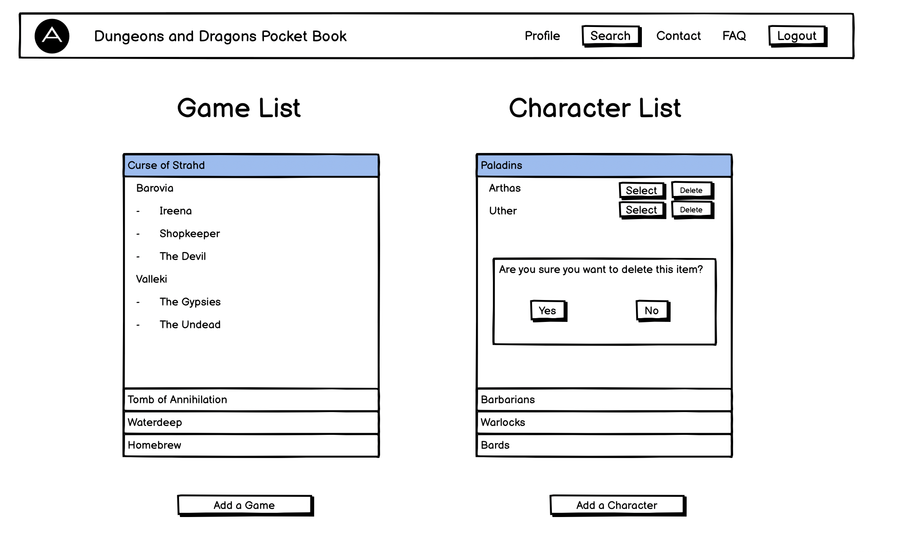
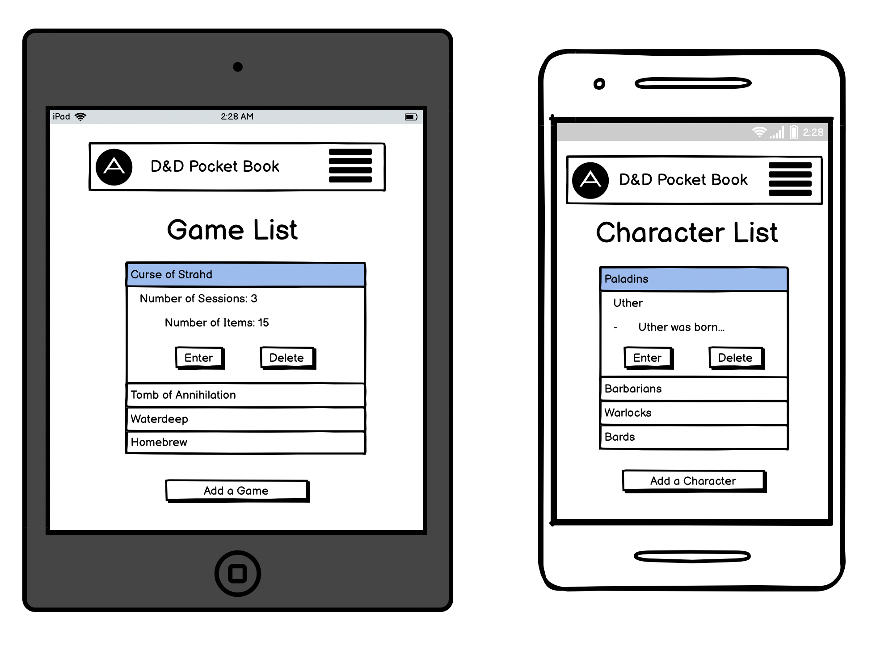

# **Dungeons and Dragons Pocketbook**

Live Link - [https://d-and-d-pocket-book.herokuapp.com/](https://d-and-d-pocket-book.herokuapp.com/)

---

## **Table of Contents**

---

- [Overview](#overview)
- [UX](#ux)
  - [Stories](#stories)
  - [Strategy](#strategy)
  - [Scope](#scope)
  - [Structure](#structure)
  - [Skeleton](#skeleton)
  - [Surface](#surface)
- [Wireframes](#wireframes)
- [Features](#features)
- [Testing](#testing)
  - [Bugs](#bugs)
- [Technologies Used](#technologies-used)
- [Resources](#resources)
- [Project barriers and the solutions](#project-barriers-and-the-solutions)
- [Deployment](#deployment)
- [Credits](#credits)
- [Acknowledgements](#acknowledgements)
- [Support](#support)

---

## **Overview**

---

The Dungeons and Dragons Pocket book is an application designed for note-taking in a more streamlined, structured and user-friendly way.

The UX is focused on being able to create and edit a list of characters and games while storing detailed notations on each.

---

## **UX**

---

### **Stories**

#### **User Stories**

As a user, I would like to...

- Be able to register/login and manage the content in my account.
- Have a space to input and store text in an organised and user-friendly way.
- Create a list of games and characters that are easily accessible on all devices.
- Be able to create sessions and detailed notations about what transpired during them.
- A separate list and notations sections for items such as people or places encountered during the game.
- Have sections for character notes with specific facets of everything I need to know/remember about my character.
- Search pages for the users to search for a specific entry if they are having difficulty locating it.

#### **Developer Stories**

"I learned to play D&D recently so learning coding at the same time has entwined them both in my current learning. 
I felt it appropriate to combine these two passions into one project."

"D&D is very complex, as is coding. This being my first project working with databases, I felt that using the game 
as a basis for building my project would be both challenging and engaging."

"Whilst playing the game I often hear my fellow players struggling to remember things and also sifting through 
their notes looking for something specific. I feel this app fill a real need for D&D enthusiasts."

### **Strategy**

#### **Project Goals:**

I believe this project fits a real need in the tabletop community and has the potential to expand its functionality and scope.
My main focus of this project is to achieve proof of concept and see how the project performs among my peers.

- Create a database that will allow unique users to control and manipulate as they see fit.
- The user to be able to create a list of all their games and characters, and input data to be easily recalled when needed.
- To optimize the UX so that during a game the user would have as much CRUD functionality as possible on a single page.
- The application to be responsive on all devices to whether the user is playing in person or online they will have easy access.

#### **User Goals:**

- Users to have full control over their written data through CRUD.
- Ability to create games, sessions, items and characters in a user.
- To eliminate the need for handwritten notes and speed up the recall of events.
- Access on all devices for users regardless of whether the game is online or tabletop.

---

[Return to Table of Contents](#table-of-contents)

---

### **Scope**

#### **Planned Functionality:**

Navbar/Sidenav:

- Nav-title - Navigates to the login screen or profile if a user is logged in.
- Profile - Navigates to the profile page.
- Search - Navigation to either the items search or sessions search pages.
    - Items - Navigates to the items search page.
    - Sessions - Navigates to the sessions search page.
- Contact - Triggers the modal for Contact Information.
    - E-mail address opens the devices default e-mail application, a new e-mail template with john.doyle.mail@icloud.com in the "To" input.
    - The social link icons open a new tab in the browser that navigates the developers profile on the corresponding site.
- FAQ - Triggers the modal for the FAQ.
- Allows the user to logout and reloads to the login/register page.

Login-Register Page:

- Login - Reveals the login form for an existing user to access their account.
    - Username Input - Enter the username you previously entered when registering.
    - Password Input - Enter the password you previously entered when registering.
    - Submit - If the user details are correct the user logs in, if not reloads the login/register page.
    - Cancel - Removes the login form.
- Register - Reveals the registration form for a new user to create an account.
    - Username Input - Enter the username you wish to use on the account.
    - Password Input - Enter the password you wish to use when logging in.
    - Submit - If the user details do not already exist, the user account is created. If they do exist, reloads the login/register page.
    - Cancel - Removes the register form.

Profile Page:

- Games List
    - Choose from a list of games the user has created.
        - Collapsible Header reveals the Collapsible Body which contains the Dungeon masters name and two buttons.
            - Enter - Opens the game page for the selected game.
            - Delete - Triggers the modal to confirm if the user wishes to delete the game.
                - The delete-game-modal
                    - Yes - Deletes the game.
                    - No - Removes the modal from the screen.
- Add Game + - Reveals the game-add-panel asking the user the enter a game name and the Dungeons Masters name.
    - The Add a Game Panel
        - Game Name Input - Enter the game name you wish to use.
        - Dungeon Master Input - Enter the name of your Dungeon Master.
        - Submit - Creates the game.
        - Cancel - Removes the card panel from the screen.
- Characters List
    - Choose from a list of characters the user has created, they are broken down into 2 sets of Collapsible Headers and Collapsible Bodies.
        - Collapsible Header Set 1 - Each class type is given its own Collapsible Header which Body contains another Collapsible Header containing each character of that class.
            - Collapsible Header Set 2 - The name of the character has its own header, the Collapsible Body contains the characters backstory and two buttons.
                - Enter - Opens the character page for the selected character.
                - Delete - Triggers the modal to confirm if the user wishes to delete the character.
                    - The delete-character-modal
                        - Yes - Deletes the character.
                        - No - Removes the modal from the screen.
- Add Character + - Reveals the char-add-panel asking the user the enter a character name and select the class of the character.
    - The Add a Character Panel
        - Character Name Input - Enter the character name you wish to use.
        - Class Selector - Select the class of the character you are creating.
        - Submit - Creates the character.
        - Cancel - Removes the card panel from the screen.

Game Page:

- Session Number - A dropdown list that shows all the sessions a user has created for this game. "(Session Number) - (Session Name) - (Session Date)"
    - When a session is selected the page reloads with the session overview text preloaded into the session overview textarea.
- Add Session + - Triggers the modal to create a new session for the game.
    - Add a Session Modal
        - Session Name Input - Choose a name to identify the session.
        - Session Number Input (hidden) - Takes the current session count, adds one to identify the session number.
        - Game Name Input (hidden) - Takes the name of the game you are currently on to identify the game the session belongs to. <br> **Only appears when a session has been selected.**
- Update Overview - Submit button for a form that posts the mirrored text from Session Overview.
    - Session-id-hidden (hidden) - Invisible input that mirrors the main session overview textarea so the form will submit the correct text.
- Session Overview - A large textarea for the user to recount the events that take place during the session in question.
- Item List - A list of all the items a user has created will be displayed.
    - Collapsible Header reveals the Collapsible Body which contains two buttons.
        - Enter - Reloads the page with the Item Overview textarea preloaded with the overview of the item in question.
        - Delete - Triggers the modal to confirm if the user wishes to delete the item.
            - The delete-item-modal
                - Yes - Deletes the item.
                - No - Removes the modal from the screen.
- Add Item + - Reveals the item-add-panel asking the user the enter an item name and the game name is preloaded in a disabled input.
     - The Add an Item Panel
        - Item Name Input - Enter the item name you wish to use.
        - Game Name Input - The game name is already preloaded in a disabled input.
        - Submit - Creates the item.
        - Cancel - Removes the card panel from the screen.
- Item Overview - A large textarea for the user to describe the details and/or interactions with the item in question.
- Update Item Overview - When an item has been selected this button posts the contents of the textarea to the selected item in the database. <br> **Only appears when an item has been selected.**
- Back -  Returns the user to their profile page.
- Reload - Reloads the page in case the user wants to discard the text they have written or wants to confirm their changes.

Character Page:

- Character Profile/Backstory
    - Large textarea for the user to describe the profile/backstory of the character in question.
- Player Notes
    - Large textarea for the user to describe the player notes of the character in question.
- Combat Style/Spell Preferences
    - Large textarea for the user to describe the combat/spell notes of the character in question.
- Character Development
    - Large textarea for the user to describe the character development of the character in question.
- Back -  Returns the user to their profile page.
- Update - Posts all 4 textareas contents to the selected with the selected character in the database.

Search Items/Sessions Page:

- Search Bar - An input element that the user can use to search all items/sessions the user has created for with the text the user has typed.
- Reset - Reloads the page, removes the text from the search bar and displays all the items/sessions the user has created.
- Search - Submits the query to narrow down all the items/sessions that contain the word present in the search field.
- Items/Sessions List - The list contains all the items/sessions the user has created, this may vary or be replaces by "No Items/Sessions Found" if nothing is matching the search field contents.
    - Item/Session List Item - Collapsible Header/Body for each list item that's relevant to either the user or the search list.
    - Edit - Opens the Edit Item/Session page for the item/session that the edit button is contained within.

Edit Item/Session Page:

- Edit Item
    - Item Name - Text input that allows the user to update the name of an item that has been selected.
    - Item Overview - Textarea that allows the user to update the overview of an item that has been selected.
    - Game Name (hidden) - A hidden text input with the game name of the session, preloaded for the form.
- Edit Session
    - Session Number (hidden) - Text input preloaded with the session number associated with the selected session.
    - Session Name - Text input that allows the user to update the name of a session that has been selected.
    - Session Date - Text input that allows the user to update the date of a session that has been selected.
    - Session Overview - Textarea that allows the user to update the overview of a session that has been selected.
    - Game Name (hidden) - A hidden text input with the game name of the session, preloaded for the form.
- Cancel - Returns the user to the Items/Sessions search page.
- Update - Posts the changes to the item/session that is currently being edited.
- Press here to delete this session - Triggers the modal to confirm if the user wishes to delete the item. <br> **Only available in the Edit Session page**
    - The delete-sess-modal
        - Yes - Deletes the session.
        - No - Removes the card panel from the screen.

Error Pages:

- When the user encounters a 404,405 or 505 error, they are redirected to the relevant error page.
    - A dragon gif floats around the screen sometimes blocking the "Back" button to simulate an encounter in D&D.

---

[Return to Table of Contents](#table-of-contents)

---

### **Structure**

#### **Interaction Design:**

Navbar/Sidenav:

- Nav-Title - Brings the user back to the profile page if they are logged in, or reloads the login-register page.
- Profile - Navigates the user to the profile page.
- Search - Dropdown appears with 2 anchors, Items and Sessions.
    - Items - Navigates the user to the Items Search Page.
    - Sessions - Navigates the user to the Sessions Search Page.
- Contact - Triggers the contact information modal
    - E-mail address opens the devices default e-mail application, a new e-mail template with john.doyle.mail@icloud.com in the "To" input.
    - The social link icons open a new tab in the browser that navigates to the developers profile on the corresponding site.
- FAQ - Triggers the Frequently Asked Questions modal.
    - Collapsible Header - This contains a question that is relevant to the operation of the application.
        - Collapsible Body - Contains the answer to the question stated in the Collapsible Header.
- Logout - Logs the customer out of the application and returns them to the login-register page.

Login-Register Page:

- Login - The button reveals the card panel with the login form.
    - Username - Input element for the user to enter the username they previously created.
    - Password - Input element for the user to enter the password they previously created.
    - Submit - Button to submit the form for the user to log into their account.
    - Cancel - Removes the card panel from the screen.
- Register - Button reveals the card panel with the registration form.
    - Username - Input element for the user to enter the username they wish to use for their account.
    - Password - Input element for the user to enter the password they wish to use for their account.
    - Submit - Button to submit the form for the user to register their account.
    - Cancel - Removes the card panel from the screen.

Profile Page:

- Game List
    - Collapsible Header - Game Name - Reveals the Dungeon Master of the game and two buttons.
        - Collapsible Body
            - Enter - Navigates the user to the game page for the selected game.
            - Delete - Triggers the delete-game-modal.
                - Yes - Deletes the game from the user's account and the database.
                - No - Removes the modal from the screen.
- Character List
    - Collapsible Header - Class - Reveals a list of characters that share the above Class.
        - Collapsible Body
            - Collapsible Header - Character - Reveals the Backstory of the character and two buttons.
                - Collapsible Body
                    - Enter - Navigates the user to the character page for the selected character.
                    - Delete - Triggers the delete-char-modal.
                        - Yes - Deletes the character from the user's account and the database.
                        - No - Removes the modal from the screen.
- Add Game Button
    - Game Name Input - Allows the user to enter the name of the game they wish to create.
    - Dungeon Master Input - Allows the user to enter the name of the games Dungeon Master.
    - Submit - Posts the form for the user to create the game.
    - Cancel - Removes the card panel.
- Add Character Button
    - Character Name Input - Allows the user to enter the name of the character they wish to create.
    - Class Selector - A selector list for the user to choose the class to which the character belongs.
    - Submit - Posts the form for the user to create the character.
    - Cancel - Removes the card panel.

Game Page:

- Session Number - Dropdown list of all the available sessions for this game.
    - When a session is selected the page reloads with the session overview text preloaded into the session overview textarea.
- Add Session + - Triggers the Add a Session modal.
    - Text input allows the user the enter a session name.
    - Submit - Adds the session with the name selected to the Session Number list.
    - Cancel - Removes the modal from the screen.
- Update Overview - When pressed whatever text is within the textarea for Session Overview gets added into the database for the session selected. <br> **Only appears when an item has been selected.**
- Session Overview - Large textarea for the user to enter the text they wish to be posted to a selected session.
- Item List
    - Collapsible Header - Clicking on an item reveals two buttons.
        - Collapsible Body
            - Enter - Reloads the page with the current item overview preloaded into the textarea.
            - Delete - Triggers the delete-item-modal.
                - Yes - Deletes the item from the user's account and the database.
                - No - Removes the modal from the screen.
- Item Overview
    - Update Item Overview - Updates the the current item overview with the new text that has been entered into the Item Overview textarea. <br> **Only appears when an item has been selected.**
- Back -  Returns the user to their profile page.
- Reload - Reloads the page in case the user wants to discard the text they have written or wants to confirm their changes.

Character Page:

- Character Profile/Backstory - Textarea to be filled with what the user feels is relevant to the field.
- Player Notes - Textarea to be filled with what the user feels is relevant to the field.
- Combat Style/Spell Preferences - Textarea to be filled with what the user feels is relevant to the field.
- Character Development - Textarea to be filled with what the user feels is relevant to the field.
- Back -  Returns the user to their profile page.
- Update - Posts all 4 textareas contents to the selected with the selected character in the database.


Search Items/Sessions Page:

- Search Bar - Text input to be filled with what the user is searching for in the list of items or sessions.
- Reset - Reloads the page, to remove any text present in the search field and show the full list of items/sessions created by the user.
- Search - Filters the list of items/sessions down to whichever ones contain the word/s specified in the search bar.
- Items/Sessions List
    - Collapsible Header - Item/Session Name
        - Pressing the header reveals the overview of the item/session selected.
    - Edit - Pressing this button navigates the user to the edit item/session page for the item/session selected.

Edit Item/Session Page:

- Edit Item
    - Item Name - Text input that allows the user to update the name of an item that has been selected.
    - Item Overview - Textarea that allows the user to update the overview of an item that has been selected.
- Edit Session
    - Session Name - Text input that allows the user to update the name of a session that has been selected.
    - Session Date - Text input that allows the user to update the date of a session that has been selected.
    - Session Overview - Textarea that allows the user to update the overview of a session that has been selected.
- Cancel - Returns the user to the Items/Sessions search page.
- Update - Posts the changes to the item/session that is currently being edited.
- Press here to delete this session - Triggers the modal to confirm if the user wishes to delete the item. <br> **Only available in the Edit Session page**
    - The delete-sess-modal
        - Yes - Deletes the session.
        - No - Removes the card panel from the screen.

Error Pages:

- When the user encounters a 404,405 or 505 error, they are redirected to the relevant error page.
    - A dragon gif floats around the screen sometimes blocking the "Back" button to simulate an encounter in D&D.

#### **Information Design:**

Navbar/Sidenav:

- Navbar Logo/Title shown on the top left-hand corner of the screen.
- Profile and Search only appear when the user is logged in.
- Contact Modal displays developers email, mobile number and social icon anchors for associated sites.
- FAQ displays multiple questions and answers to assist users with navigating and using the application.

Flash Messages:

- " - Username Already Exists - " - When a user tries to register for an account with a username that already exists.
- " - Registration Successful - " - When a user successfully registers their username and password.
- " - Welcome, {username} - " - When a user successfully signs in with an existing username and password.
- " - Incorrect Username and/or Password - " - When a user has tried to login and the username and/or password does not match anything stored in the database.
- " - There is no user currently logged in - " - When a user tries to access pages on the site without being authenticated.
- " - You have been logged out - " - When a logged-in user presses the logout button.
- " - Game Successfully Added - " - When a user successfully creates a game.
- " - Character Successfully Added - " -  When a user successfully creates a character.
- " - Game Successfully Deleted - " - When a user clicks/presses yes on the delete game modal.
- " - Character Successfully Deleted - " - When a user clicks/presses yes on the delete character modal.
- " - Session Successfully Added - " - When a user successfully adds a session to a game.
- " - Session Successfully Updated - " - When a user updates the overview of a session.
- " - Item Successfully Added - " - When a user successfully creates an item.
- " - Item Successfully Updated - " - When a user updates the overview of an item.
- " - Item Successfully Deleted - " - When a user clicks/presses yes on the delete item modal.
- " - Character Successfully Updated - " - When a user updates all 4 textareas of the character page.
- " - Item Successfully Edited - " - When a user edits the overview of an item.
- " - Session Successfully Edited - " - When a user edits the overview of a session.
- " - Session Successfully Deleted - " - When a user clicks/presses yes on the delete session modal.

Login-Register Page:

- When the login window is displayed, the title is "Welcome Back".
- When the register window is displayed the title is "Join us...".

Profile Page:

- Profile Title with the username of the logged-in account.
- Game list
    - All the games that the user has created.
    - Collapsible
        - Each game will have the Dungeon Master stated on creation. And Two Buttons.
            - Enter
            - Delete - Triggers the delete-game-modal.
                - Modal will ask the user "Are you sure you want to delete this game? The user has two options.
                    - Yes
                    - No
- Character List
    - Collapsible Header Set 1 - All of the classes that a user has created a character with.
        - Collapsible Body
            - Collapsible Header Set 2 - All of the characters that a user has created in that class.
                - Collapsible Body - The characters background appears above two buttons.
                    - Enter
                    - Delete - Triggers the delete-char-modal.
                        - Modal will ask the user "Are you sure you want to delete this character? The user has two options.
                            - Yes
                            - No

Game Page:

- Game Title shows the name of the game entered.
- Session Number - This will show the number of sessions created for this game.
    - Each session will show the session number, the date of the session and the sessions name. <br> **Only appears when an item has been selected.**
- Add Session + - Will trigger the Add a Session Modal.
    - Will ask the user to enter what they wish the name of the session will be.
- Item list
    - List of items created by the user for this game specifically.
        - Collapsible Header
            - Shows the name of the item, when clicked reveals two buttons.
                - Enter - Reloads the page with the current item overview in the Item Overview text area.
                - Delete - Triggers the delete-item-modal.
                    - Modal will ask the user "Are you sure you want to delete this item? The user has two options.
                        - Yes
                        - No
- Item Overview - Textarea the user will create/update the text associated with the selected item.
    - Update Item Overview - Submit button for the form to update the current item overview for the overview of the selected items. <br>  **Only appears when an item has been selected.**
- Back -  Returns the user to their profile page.
- Reload - Reloads the page in case the user wants to discard the text they have written or wants to confirm their changes.

Character Page:

- Four Textareas for user input about the character selected.
    - Character Profile/Backstory
    - Player Notes
    - Combat Style/Spell Preferences
    - Character Development
- Back -  Returns the user to their profile page.
- Update - Posts the changes the user has made to the four textareas to the character in the database.

Search Items/Sessions Page:

- Page title tells the user what they are searching for "Items Search" or "Sessions Search".
- Items List
    - A list of all the items created by the user.
        - Collapsible Header - Shows the name of the item and the game it was created in. "{Item Name} - {Game Name}"
            - Collapsible Body - shows the overview of the item selected.
        - Edit - Button to navigate the user to the edit page for the selected item.
- Sessions List
    - A list of all the sessions created by the user.
        - Collapsible Header - Shows the session numberm name of the session, session date and the game it was created in. "{Session Number} - {Session Name} - {Session Date} - {Game Name}"
            - Collapsible Body - shows the overview of the session selected.
        - Edit - Button to navigate the user to the edit page for the selected item.

Edit Item Page:

- Page title is the name of the item selected. "Edit - {Item Name}
- One text input and one textarea box with current item name and overview preloaded for the user to edit.
- Cancel - Returns the user to the items search page.
- Update Item - Submit button on the form to update the values for the selected item.


Edit Session Page:

- Page title is the name of the item selected. "Edit - {Item Name}
- Two text inputs and one textarea box with current session name, session date and overview preloaded for the user to edit.
- Cancel - Returns the user to the sessions search page.
- Update Session - Submit button on the form to update the values for the selected session.
- Press here to delete this session - Triggers the modal to confirm if the user wishes to delete the item. <br> **Only available in the Edit Session page**
    - The delete-sess-modal
        - Yes - Deletes the session.
        - No - Removes the card panel from the screen.

Error Pages:

- When the user encounters a 404,405 or 505 error, they are redirected to the relevant error page.
    - A message stating "You seem to have entered through door {relevant error}... Turn back or die...".

---

[Return to Table of Contents](#table-of-contents)

---

### **Skeleton**

- [Wireframes](#wireframes)
- Persistent navbar on all pages that allows for navigation of the app and logging out.
- Login-Register page has two buttons to switch between the login or register panels.
- Profile page shows the user logged in and the list of games and characters they have created, along with buttons to create new ones.
- Game page with two sections, sessions and items. Text areas for user input and buttons to create instances and update the content associated with them.
- Character page with four text boxes and two buttons.
- Search Pages (Items and Sessions) with a search field and a list of all items/sessions that narrows down depending on what is searched.
- Edit Pages (Item and Session) that allow the user to edit more specific fields and update them when necessary.

[Return to Table of Contents](#table-of-contents)

---

### **Surface**

#### **Images**

Base Background: This is the constant background on all pages and is the basis for the overall colour scheme of the site.

Error GIF: A gif to simulate an encounter in Dungeons & Dragons. The gif moves around the page and depending on its position on the page will block users from pressing the back button.

#### **Colours**

I used the background image as a baseline for the colour scheme of the overall site.

[Coolers](https://coolors.co/) was then used to choose colours to complement the baseline.

#### **Typography**

- "Titillium" font (san serif as backup)

---

[Return to Table of Contents](#table-of-contents)

---

## **Wireframes**

---
Hompage

Homepage with login panel

Homepage on medium/small devices

Homepage on medium/small devices with login panel

Profile page

Profile page on medium/small devices

Profile page on medium/small devices showing sidenav 

Game page

Game page on medium/small devices

Character page

Character page on medium/small devices

Items Search Page

Items Search Page on medium/small devices

Sessions Search Page

Sessions Search Page on medium/small devices

Edit Item Page

Edit Item Page on medium/small devices

Edit Session Page

Edit Session Page on medium/small devices


---

[Return to Table of Contents](#table-of-contents)

---

## **Features**

---

### **Existing Features**

- Designed with HTML5, CSS3, JavaScript and Python.
- 12 separate HTML pages.
- Navbar with logo/title, anchors, logout button and sidenav with anchors.
- Collapsible headers/bodies on games, classes, characters and items.
- Dropdown triggers/content to allow the users to switch between sessions and pressing search in the navbar/sidenav.
- Selector for picking the relevant class on character creation.
- Modals pop up when adding a new session and confirming a delete when requested by the user.

### **Features Left to Implement when skills develop**

- A password reset option for users.
- When the user updates a session or an item overview, the page reloads with the item/session you just updated rather than the base blank page.
- Sharing games, characters, sessions and items between different users.
- Opportunity for users to upload character art to their profiles.
- Place for users to upload a pdf of the characters "character sheet" from any games they may be using the character in.
- A Board/Chatroom space for users to discuss games and possibly network to create new games/groups. 

---

[Return to Table of Contents](#table-of-contents)

---

## **Testing**

---

### **Screen Testing**

Checked compatibility in Safari, Chrome, Firefox

#### Google Chrome Developer Tools - Device frames tests

- Moto G4
- Galaxy S5
- Pixel 2
- Pixel 2 XL
- iPhone 5/SE
- iPhone 6/7/8
- iPhone 6/7/8 Plus
- iPhone X
- iPad
- iPad Pro
- Surface Duo
- Galaxy Fold

#### Desktop Screen Sizes

- 24" - 1920x1200
- 23" - 1920x1080
- 22" - 1680x1050
- 20" - 1600x900

#### Notebook Sizes

- 15" - 1366x768
- 13" - 1024x800
- 10" - 1024x600

#### Tablet Screen Sizes

- iPad Mini - 768x1024
- iPad Retina - 768x1024
- iPad Pro - 1366x1024
- Kindle Fire - 768x1024
- Kindle Fire HD - 768x1024
- Asus Eee - 768x1024
- Nexus 7 - 600x960
- Nexus 9 - 1024x768
- Galaxy Tab 10 - 800x1280

#### Tablet Screen Sizes

- Apple iPhone 3/4/4s - 320x480
- Apple iPhone 5/5s - 320x586
- Apple iPhone 6/6s/7 - 375x667
- Apple iPhone 6 Plus/7 Plus - 414x736
- Samsung Galaxy S5/S6/S7 - 360x640
- Sony Xperia Z2/Z3 - 360x640
- Google Pixel - 411x731
- Nexus 4 - 384x640
- Nexus 5 - 411x731
- Nexus 6 - 411x731

I have tested the website on various physical devices (iPad, iPad Air, Macbook Pro)

### **Validator**

- HTML - [W3C](https://validator.w3.org/) - Markup Validation

- CSS - [W3C](https://jigsaw.w3.org/css-validator/) - Jigsaw CSS Validation

- JavaScript - [JSHINT](https://jshint.com/) - JavaScript code warning & error check

- Python - [Pyton Tester](https://extendsclass.com/python-tester.html) Python code syntax checker

### **Defensive Design**

- When the user attempts to delete an object, a modal confirming their decision appears.
- Ensuring all target="\_blank" links are accompanied by rel="noreferrer".
- Designing the site to be comfortably navigated without having to use the back button in the browser interface.

---
### Manual Testing 
---

Navbar/Sidenav:

- Nav-title - Navigates to the login screen or profile if a user is logged in.
- Profile - Navigates to the profile page.
- Search - Triggers the dropdown list and shows two items.
    - Items - Navigates to the items search page.
    - Sessions - Navigates to the sessions search page.
- Contact - Triggers the modal for Contact Information.
    - E-mail address opens the devices default e-mail application, a new e-mail template with john.doyle.mail@icloud.com in the "To" input.
    - The social link icons open a new tab in the browser that navigates to the developers profile on the corresponding site.
- FAQ - Triggers the modal for the FAQ.
    - Collapsible Headers with the questions reveal the Collapsible Bodies with the answers.
- Allows the user to logout and reloads to the login/register page.

Sidenav:

- Profile - Navigates profile to the profile page.
- Search - Triggers the dropdown list and shows two items.
    - Items - Navigates to the items search page.
    - Sessions - Navigates to the sessions search page.
- Contact - Triggers the modal for Contact Information.
    - E-mail address opens the devices default e-mail application, a new e-mail template with john.doyle.mail@icloud.com in the "To" input.
    - The social link icons open a new tab in the browser that navigates the developers profile on the corresponding site.
- FAQ - Triggers the modal for the FAQ.
    - Collapsible Headers with the questions reveal the Collapsible Bodies with the answers.
- Allows the user to logout and reloads to the login/register page.

Login-Register Page:

- Login - Reveals the login form for an existing user to access their account.
    - Submit - If the user details are correct the user logs in, if not reloads the login/register page.
    - Cancel - Removes the login form.
- If the Login panel is selected while the Register panel is showing, the Register is removed and the Login takes its place.
- Register - Reveals the registration form for a new user to create an account.
    - Submit - If the user details do not already exist, the user account is created. If they do exist, reloads the login/register page.
    - Cancel - Removes the register form.
- If the Register panel is selected while the Login panel is showing, the Login is removed and the Register takes its place.

Profile Page:

- Games List
    - The list shows all the current games that the user has created.
        - Collapsible Header reveals the Collapsible Body which contains the Dungeon masters name and two buttons.
            - Enter - Opens the game page for the selected game.
            - Delete - Triggers the modal to confirm if the user wishes to delete the game.
                - The delete-game-modal
                    - Yes - Deletes the game.
                    - No - Removes the modal from the screen.
                - If the user presses Yes, the game is deleted from the Game List.
- Add Game + - Reveals the game-add-panel asking the user the enter a game name and the Dungeons Masters name.
    - The Add a Game Panel
        - Game Name Input - Enter the game name you wish to use.
        - Dungeon Master Input - Enter the name of your Dungeon Master.
        - Submit - Creates the game.
        - Cancel - Removes the card panel from the screen.
        - Once the Submit button has been pressed the page reloads with the game added to the Game List and the games collection.
- Characters List
    - Choose from a list of characters the user has created, they are broken down into 2 sets of Collapsible Headers and Collapsible Bodies.
        - Collapsible Header Set 1 - Each class type is given its own Collapsible Header which Body contains another Collapsible Header containing each character of that class.
            - Collapsible Header Set 2 - The name of the character has its own header, the Collapsible Body contains the characters backstory and two buttons.
                - Enter - Opens the character page for the selected character.
                - Delete - Triggers the modal to confirm if the user wishes to delete the character.
                    - The delete-character-modal
                        - Yes - Deletes the character.
                        - No - Removes the modal from the screen.
                    - If the user presses Yes, the character is deleted from the Character List.
- Add Character + - Reveals the char-add-panel asking the user the enter a character name and the class of the character.
    - The Add a Character Panel
        - Character Name Input - Enter the character name you wish to use.
        - Class Selector - Select the class of the character you are creating.
        - Submit - Creates the character.
        - Cancel - Removes the card panel from the screen.
        - Once the Submit button has been pressed the page reloads with the character added to the Character List and the characters collection.

Game Page:

- Session Number - A dropdown list that shows all the sessions a user has created for this game showing. "(Session Number) - (Session Name) - (Session Date)"
    - When a session is selected the page reloads with the session overview text preloaded into the session overview textarea.
- Add Session + - Triggers the modal to create a new session for the game.
    - Add a Session Modal
    - Submit - Adds the session with the name selected to the Session Number list and the sessions collection.
    - Cancel - Removes the modal from the screen.
- Update Overview - Submit button for a form that posts the mirrored text from Session Overview.
    - Session-id-hidden (hidden) - Invisible input that mirrors the main session overview textarea so the form will submit the correct text.
- Item List - The list shows all the current items that the user has created.
    - Collapsible Header reveals the Collapsible Body which contains two buttons.
        - Enter - Reloads the page with the Item Overview textarea preloaded with the overview of the item in question.
        - Delete - Triggers the modal to confirm if the user wishes to delete the item.
            - The delete-item-modal
                - Yes - Deletes the item.
                - No - Removes the modal from the screen.
- Add Item + - Reveals the item-add-panel.
     - The Add an Item Panel
        - Submit - Creates the item.
        - Cancel - Removes the card panel from the screen.
    - Once the Submit button has been pressed the page reloads with the character added to the Items List and the items collection.
- Update Item Overview - When an item has been selected this button posts the contents of the textarea to the selected item in the database. <br> **Only appears when an item has been selected.**
- Back -  Returns the user to their profile page.
- Reload - Reloads the page in case the user wants to discard the text they have written or wants to confirm their changes.

Character Page:

- Back -  Returns the user to their profile page.
- Update - Posts all 4 textareas contents to the selected with the selected character in the database.

Search Items/Sessions Page:

- Search Bar - The input accepts any text that the user types.
- Reset - Reloads the page, removes the text from the search bar and displays all the items/sessions the user has created.
- Search - Submits the query to narrow down all the items/sessions that contain the word present in the search field.
- Items/Sessions List - The list contains all the items/sessions the user has created. If the search yields no results, "No Items/Sessions Found" is displayed instead of the list.
    - Item/Session List Item - Collapsible Header/Body for each list item that's relevant to either the user or the search list.
        - Collapsible Header when clicked reveals the Collapsible Body that shows the overview of the item/session in question.
    - Edit - Opens the Edit Item/Session page for the item/session that the edit button is contained within.

Edit Item/Session Page:

- Cancel - Returns the user to the Items/Sessions search page.
- Update - Posts the changes to the item/session that is currently being edited.
- Press here to delete this session - Triggers the delete-sess-modal. **Only available on the Edit Session page**
    - The delete-sess-modal
        - Yes - Deletes the session currently being edited. 
        - No - Removes the modal from the screen.

Error Pages:

- When the user encounters a 404,405 or 505 error, they are redirected to the relevant error page.
    - A message stating "You seem to have entered through door {relevant error}... Turn back or die...".
    - A dragon gif floats around the screen sometimes blocking the "Back" button to simulate an encounter in D&D.

---

### **Bugs**

---

#### **Found**

1. Delete Modals would not display at the correct time. The Contact and FAQ did not have this problem the issue was localised to the delete modals.
2. Attempting to have CRUD functionality over multiple collections proved problematic.
3. When having two characters of the same class, rather than having two characters under one class header, there were two class headers, one for each character.
    Eg. (Rather than having...   <br>&nbsp;&nbsp;&nbsp; - Paladin
                                    <br>&nbsp;&nbsp;&nbsp;&nbsp;&nbsp;&nbsp;&nbsp;  - Arthas
                                    <br>&nbsp;&nbsp;&nbsp;&nbsp;&nbsp;&nbsp;&nbsp;  - Uther <br>
    It was displaying like this...  <br>&nbsp;&nbsp;&nbsp; - Paladin
                                    <br>&nbsp;&nbsp;&nbsp;&nbsp;&nbsp;&nbsp;&nbsp;  - Arthas
                                    <br>&nbsp;&nbsp;&nbsp; - Paladin
                                    <br>&nbsp;&nbsp;&nbsp;&nbsp;&nbsp;&nbsp;&nbsp;  - Uther <br>

#### **Resolution**

1. For example... The modal href needed a "game._id" attached for the "game-delete-button". Eg. (href="#game-delete-modal-{{ game._id }}) This also needed to be applied to the character, item and session delete buttons.
2. The app.route in question needed more specific variables and in some cases multiple arguments to achieve the desired result.
3. For the list to display correctly, I had to create a dictionary with a for loop within the app.route to display the list as intended.

#### **Unresolved**

- If the user refreshes the URL bar after having searched for something in either Items Search or Sessions Search, the application throws a 405 error.
- While testing the device on my iPhone, I realised my CSS was being overwritten. My nav-title was appearing too large and causing spatial issues on all pages.

[Return to Table of Contents](#table-of-contents)

---

## **Technologies Used**

---

### **1. Languages**

- [HTML5](https://en.wikipedia.org/wiki/HTML5)
- [CSS3](https://en.wikipedia.org/wiki/Cascading_Style_Sheets)
- [JavaScript](https://en.wikipedia.org/wiki/JavaScript)
- [Python](https://en.wikipedia.org/wiki/Python_(programming_language))

### **2. Integrations**

- [Materialize](https://materializecss.com/) by linking via [Materialize CDN](https://materializecss.com/getting-started.html) to HTML Doc
- [jQuery](https://jquery.com) by linking via jQueryCDN to HTML Doc.
- [FontAwesome](https://fontawesome.com/) Icons for links in Footer.
- [Google Fonts](https://fonts.google.com/) - Overall Typography import.
- [Flask](https://flask.palletsprojects.com/en/1.1.x/) Micro web framework written in Python.
- [MongoDB](https://www.mongodb.com/) NoSQL database program, using JSON-like documents.


### **3. Workspace, version control and Repository storage**

- [GitPod](https://github.com/mkuti/corklagos-venture/blob/master/gitpod.io) - Main workspace IDE(Integrated Development Environment)
- [Git](https://git-scm.com/) - Distributed Version Control tool to store versions of files and track changes.
- [GitHub](https://github.com/) - A cloud-based hosting service to manage my **Git** repositories.
- [Heroku](https://heroku.com) - Container-based cloud platform for deployment and running of apps.

---

[Return to Table of Contents](#table-of-contents)

---

## **Resources**

---

- [Code Institute Course Content](https://courses.codeinstitute.net/)
- Code Institute **SLACK Community**
- [Coolers](https://coolors.co/) - Color picker
- [Stack Overflow](https://stackoverflow.com/) - General resource
- [Youtube](https://www.youtube.com/) - General resource
- [CSS-Tricks](https://css-tricks.com/) - General resource
- [W3.CSS](https://www.w3schools.com/w3css/4/w3.css) - General resource
- [Balsamiq](https://balsamiq.com/wireframes/) - Wire-framing design tool
- Unicorn Revealer - Chrome Extension
- ColorZilla - Chrome Extension

---

[Return to Table of Contents](#table-of-contents)

---

## **Project barriers**

---

- What I want to do and what I can do, was a constant roadblock, I had a strong idea about what I wanted this app to be, and it was often outside what I was capable of at this point.
- To optimize the UX, I wanted one page to have CRUD functionality across multiple collections. This proved difficult as the code required was far more complex than I had expected.
- The session overview textarea was outside the form, so I had to create a hidden element in the update-overview button/form to mirror what was in the session overview textarea.

---

[Return to Table of Contents](#table-of-contents)

---

## **Deployment**

---

GitPod was used to write all code in this repository and pushed via Git to GitHub.

### Local Installation

#### 1. Cloning the project

- The code can be run locally through clone or download from the repository on [GitHub](https://github.com/Aramantos/MS3-D-and-D-Pocket-Book).
- You can do this by opening the repository, clicking on the Code' button and selecting either 'clone or download'.


- The Clone option provides a URL, which you can use on your CLI with `git clone <paste url>`.
- The Download ZIP option provides a link to download a ZIP file that can be unzipped on your local machine. The files can then be uploaded to your IDE.

#### 2. Create Environmental Variables

- Create an env.py file, in this file enter the Environmental Variables (**replace values with your own**) as follows:

```python
        import os

        os.environ.setdefault("IP", "IP_ADDRESS")
        os.environ.setdefault("PORT", "PORT")
        os.environ.setdefault("SECRET_KEY", "SECRET_KEY")
        os.environ.setdefault("MONGO_URI", "MONGO_URI")
        os.environ.setdefault("MONGO_DBNAME", "MONGO_DBNAME")
```

#### 3. Create a .gitignore file

- Create a file called **.gitignore** in the root directory and ensure it contains the following git exclusions:

```text
        core.Microsoft*
        core.mongo*
        core.python*
        env.py
        __pycache__/
        *.py[cod]
        node_modules/
```

#### 4. Install project dependencies

- Install project requirements by typing `pip install -r requirements.txt`

#### 5. Create a database on MongoDB

Register for a free account with [MongoDB](https://account.mongodb.com/account/register)

- Create a new Project and call it 'DandD-PocketBook'.
- Create a Cluster, choose the free tier option and select your region, the name I choose was 'PocketBook'.
- Create a new database and call it 'd-and-d-pocket-book'.
- Create five Collections named 'characters', games', 'items', 'sessions' and 'users' an enter key/values as follows:  

- **characters** collection

```json
            _id: <ObjectId>
            character_name: "<string>"
            class: "<string>"
            profile_backstory: "<string>"
            player_notes: "<string>"
            combat_spells: "<string>"
            character_development: "<string>"
            created_by: "<string>"
```

- **games** collection

```json
            _id: <ObjectId>
            game_name: "<string>"
            dm: "<string>"
            created_by: "<string>"
```

- **items** collection

```json
            _id: <ObjectId>
            item_name: "<string>"
            item_desc: "<string>"
            game_name: "<string>"
            created_by: "<string>"
```

- **sessions** collection

```json
            _id: <ObjectId>
            session_num: "<int32>"
            session_desc: "<string>"
            game_name: "<string>"
            created_by: "<string>"
```

- **users** collection

```json
            _id: <ObjectId>
            username: "<string>"
            password: "<string>"
```

#### 6. Deploy locally

- To run the project locally, in the terminal type `python app.py`
- This will open a localhost address, which is provided in the CLI.

#### 7. Remote Deployment on Heroku

[Heroku](https://www.heroku.com) is a Cloud Application Platform that enables developers to build, run, and operate applications in the cloud.

The Deployment process is as follows:

Create a **requirements.txt** file to store dependencies of installed packages for the project. In the CLI type `pip freeze --local > requirements.txt`.

Create a file named **Procfile** to declare what commands are run by the application's dynos on the Heroku platform. For this project, run by the app.py file, the Procfile should contain: `web: python app.py`

- Register for a free account on the Heroku [Signup](https://signup.heroku.com/login) page.
- On the Dashboard, click the 'New' button and select 'Create new app'.
- Choose a name and region.
- Under the 'Settings' tab, click on 'Config Vars' to add Configuration Variables from the env.py file (As shown in step **3. Create Environmental Variables** above). Remember to use your own credentials.
- In your CLI terminal install Heroku by typing `npm install -g heroku`
- Select the 'Deploy' option from the menu.
- Under the 'Deployment method' select the GitHub option to connect to your GitHub repository. Ensure GitHub Username is selected and use the search function to find the relevant repository. It is recommended to use a 'main' branch as default, due to GitHub depreciating the 'master' branch name.
- Select Automatic deploys from the main branch and click 'Deploy Branch'.
- Click on the 'Open App' button on the top-right to open the deployed app.
- There is no difference between the deployed version and the development version.

---

[Return to Table of Contents](#table-of-contents)

---

## **Credits**

---

### **Media**

Pictures

- Site background [image](http://s1.picswalls.com/wallpapers/2014/01/29/dragon-picture_063725311_21.jpg)
- Error Message [gif](http://clipart-library.com/images/qiBojrGoT.gif)

### **Code Snippets**

CI Task Manager Mini-Project - I used the lessons designed by **[Tim Nelson](https://github.com/TravelTimN)** as building blocks to develop this application.

---

[Return to Table of Contents](#table-of-contents)

---

## **Acknowledgements**

---

### I would like to thank

- **[CI staff](https://codeinstitute.net/)** and **[Slack Community](https://slack.com/intl/en-ie/)**
- **[Guido Cecilio](https://github.com/guidocecilio)** - My mentor, for his time and guidance.
- **[Sean Murphy](https://github.com/nazarja)** - For his knowledge and reliable feedback.
- **[Anthony O'Brien](https://github.com/auxfuse)** - For his expertise in the industry.
- **[Jim Lynx](https://github.com/JimLynx)** - For his support and assistance.

---

## **Support**

---

If you require any help or assistance you may contact me on

john.doyle.mail@icloud.com

---

[Return to Table of Contents](#table-of-contents)

---